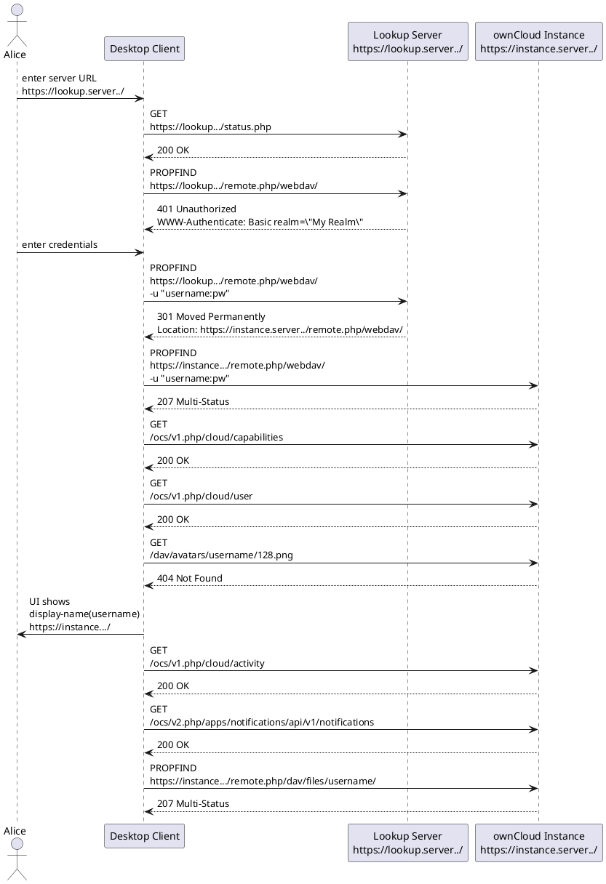

# Redirect for Multi Tenancy installations

You can setup a central server, which dispatches connections to the right ownCloud instance, e.g. based on the username.
Consider several ownClouds running under subdomains or pathes like

* https://instance1.domain.com
* https://instance2.domain.com
* https://instance3.domain.com

while the user doesn't know about the instances and only sees the central server

* https://domain.com

The idea is, an ownCloud user with an login name ```felix@instance2.domain.com``` gets redirected to use the  ```https://instance2.domain.com``` automatically.

The redirects can be done for desktop sync clients and mobile apps.

## Sync Client

On connection the clients are requesting

1. status.php
2. remote.php/webdav

with an authentication attempt in the second.

The ```status.php``` needs to be on the central server, just to proceed with the authentication.
Now in ```remote.php``` the username can be evaluated to distinguish the correct instance and redirect.

All you need on the central server are those two files, and you can customize the code for the selection of the instances.

##  Mobile Apps

Released versions with this included.
* Android: 1.7.2 version
* iOS: 3.4.4 version

## Web frontend

Needs to be done.

## Example

The code is running in an example deployment.

You can connect with a sync client to the central redirect server: 

```
https://owncloud.achernar.uberspace.de
```

Possible usernames:

* test@instance1.com
* test@instance2.com
* test@instance3.com

which get redirected to ```https://owncloud.achernar.uberspace.de/instanceX```.
Password is: ```secret```.

Or try with curl:

```
curl -v -L -u'test@instance3.com:secret' https://owncloud.achernar.uberspace.de/remote.php/webdav/
```

## Flow Sequence Diagram (Desktop 2.7)




to edit go to [PlantUML](http://www.plantuml.com/plantuml/uml/pPJ1Rjim38RlUGeYf-tWECq2R32seLsx3i6IDaWNvE8BAxEBK9aI9Df1zlIptHLhwnHeu6NepQP4wUEldpmEWbwAtFHGYVLmOhIYdgjYMcc7BD0_et0hri6fqSJIVxmujVQsS715lYIVybh4XIIEJHCUX2Oy6CHFiko6JuqjCfXm46H5VpFrdyZ3t5v31T7d5am2n48UxZR3SZ5zdg7NUvfTd_ZY2XBuzlL7QxrQ2O9IX85Rk_O57wDednj6mo5SVkyCEbzSpiyd5sUxQ3tbLgYcZJTqdM4PTwOU3uzWoLZ8sdhzYxAKLwjLT5Bz4ujMA9J05mnQWISq-QUqFzl2elvCN_AsobDM7uGc_6TbKeuAw1U1F6DEYTlqEslrhj9gPalAO4u-HoOMiqrvQXMAjfp0yttGvjifnnxTrHAbjQsRBFk2Z8RlOLOOqT5LqrCTwclrRMnLYCkZfWvLPySA7LvheqLJw510ktyFYrth_dfnQtzWYO8-nFSEYOz67mQEV_uZwl5m31TMuDmMdEs6RsPA0ii9XBNTX9Gp7Pp1RLJZlBddUhlRy8TzFbIYIotRL-wuKOECpeMOhUWRVJUVGXNILK6FWmUivV13hNRiZJRqmA-76cV7n5cHczy0)
